<picture>
  <source media="(prefers-color-scheme: dark)" srcset="dark.svg">
  <source media="(prefers-color-scheme: light)" srcset="light.svg">
  
</picture>

 

### 🧭 About Me

- 🎓 Fresh graduate — B.Sc. Information Systems, Universitas Advent Indonesia (GPA 3.72)
- 💼 Backend Developer Intern @ PT Jelajah Data Semesta — Laravel, Docker, Redis, Clean Architecture
- 🌐 Web Developer Intern @ deGadai
- 🤖 AI Engineer Cohort Graduate — Laskar AI
- 🔭 Currently building agentic RAG systems & self-hosted AI pipelines
- 📍 Based in East Jakarta, Indonesia — open to relocation
- 📫 Reach me at **your-email@example.com**

 

### 🛠️ Tech Stack

  
  
  
  
  
  
   
  
  
  
  
  

 

### 📊 GitHub Stats

  
  

  

### 🌐 Connect With Me

  
  
  

 

<i>Thanks for stopping by — always open to a chat about backend systems or AI agents.</i>

